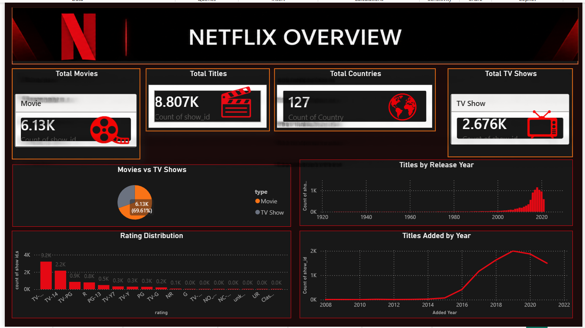
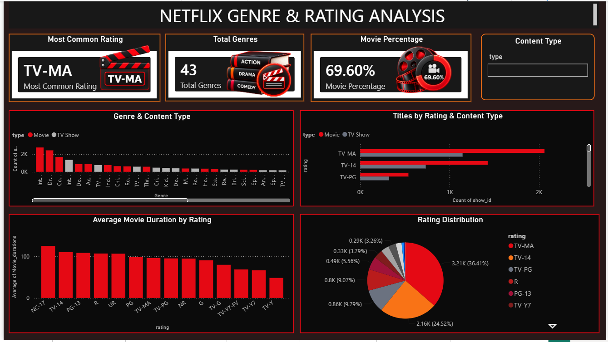
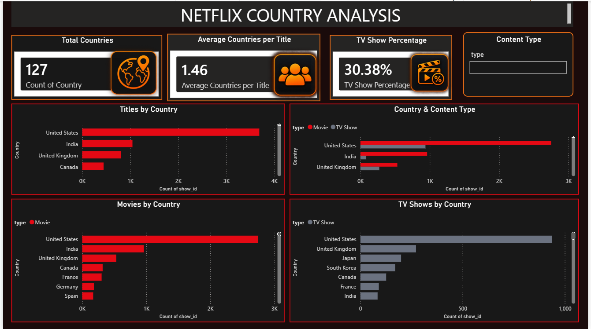
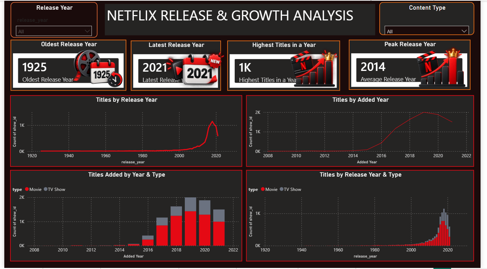
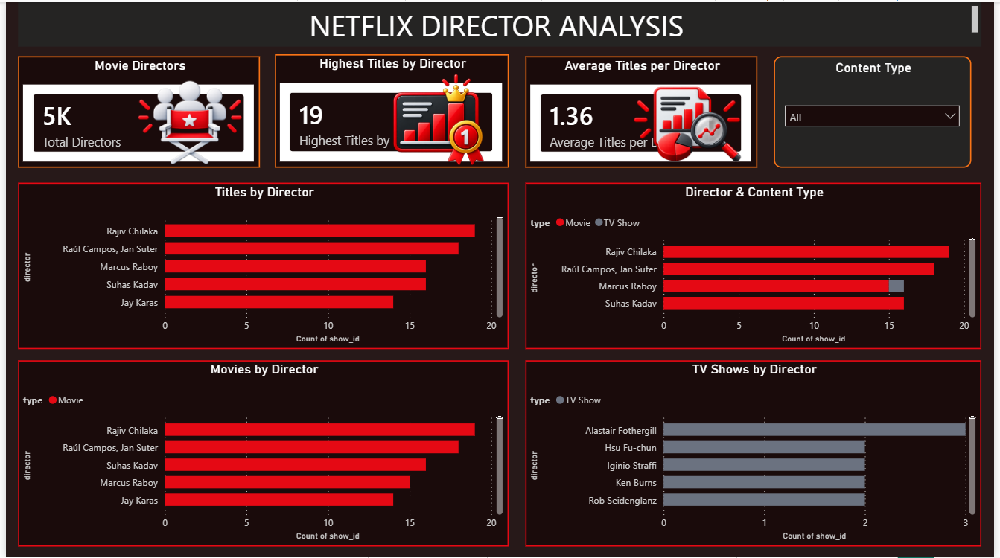
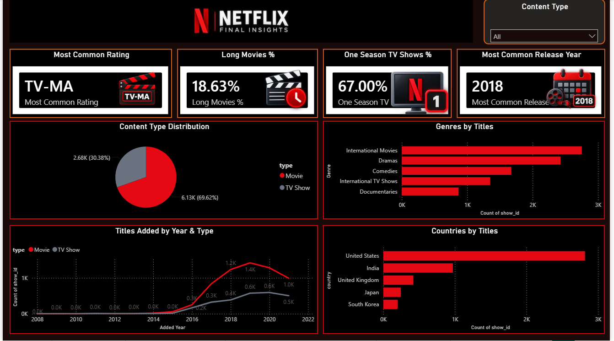

# 🎬 Netflix Movies & TV Shows — EDA & Power BI Dashboard

Data analytics project exploring Netflix Movies and TV Shows using Python, Pandas, and NumPy for data cleaning, preprocessing, feature engineering, and Exploratory Data Analysis (EDA), followed by an interactive Power BI dashboard for visualization and insight generation.

---

## 📊 Project Overview

This project analyzes the Netflix Movies and TV Shows dataset to understand content type, ratings, genres, countries, directors, movie durations, TV show seasons, and release trends.

Python was used for data cleaning and EDA, and the final processed dataset was used to build an interactive Power BI dashboard.

---

## 🧹 Data Cleaning & Preprocessing

Using Python, Pandas, and NumPy:

- Handled missing values
- Replaced infinite and negative infinite values
- Removed duplicate records
- Converted `date_added` to datetime format
- Handled missing director, cast, country, rating, and duration values
- Prepared the dataset for analysis and visualization

---

## 🔍 Exploratory Data Analysis (EDA)

EDA was performed using Pandas and NumPy to analyze:

- Movies vs TV Shows
- Ratings
- Genres
- Countries
- Directors
- Movie durations
- TV show seasons
- Release years
- Content added over time

Feature engineering included extracting movie duration and TV show seasons and creating duration and season categories.

The complete Python analysis is available in `Netflix_EDA.py`.

---

## 📈 Power BI Dashboard

The processed dataset was used to create a **7-page interactive Power BI dashboard**.

### 1. 🎬 Netflix Overview

- Total Titles
- Total Movies
- Total TV Shows
- Total Countries
- Movies vs TV Shows
- Titles Added by Year
- Rating Distribution
- Titles by Release Year



---

### 2. 📺 Content Analysis

- Content Type by Release Year
- Movie Duration Distribution
- Movies by Duration Category
- TV Shows by Number of Seasons
- TV Shows by Release Year
- Average Movie Duration
- Average TV Show Seasons


---

### 3. 🎭 Genre & Rating Analysis

- Genre by Content Type
- Rating by Content Type
- Average Movie Duration by Rating
- Rating Distribution
- Most Common Rating
- Total Genres
- Movie Percentage



---

### 4. 🌍 Country Analysis

- Country Distribution
- Country by Content Type
- Movies by Country
- TV Shows by Country
- Total Countries
- Average Countries per Title
- TV Show Percentage



---

### 5. 📅 Release & Growth Analysis

- Titles by Release Year
- Titles Added by Year
- Titles Added by Year & Type
- Titles by Release Year & Type
- Total Releases
- Oldest Release Year
- Latest Release Year
- Highest Titles in a Year
- Peak Release Year



---

### 6. 🎥 Director Analysis

- Titles by Director
- Director by Content Type
- Movies by Director
- TV Shows by Director
- Total Directors
- Highest Titles by Director
- Average Titles per Director



---

### 7. 💡 Final Insights

- Most Common Rating — TV-MA
- Long Movies — 18.63%
- One Season TV Shows — 67.00%
- Most Common Release Year — 2018
- Content Type Distribution
- Genres by Titles
- Titles Added by Year & Type
- Countries by Titles



---

## 🛠️ Tools & Technologies

- Python
- Pandas
- NumPy
- Power BI
- Jupyter Notebook / VS Code
- GitHub

---

## 📈 Key Insights

The dashboard provides insights into:

- Movie and TV Show distribution
- Rating patterns
- Genre popularity
- Country-wise content distribution
- Movie duration patterns
- TV show season patterns
- Director-level content distribution
- Release and content addition trends

---

## 🎯 Project Objective

The objective of this project is to transform raw Netflix data into meaningful insights through Python-based data cleaning and Exploratory Data Analysis, and present the results using an interactive Power BI dashboard.

---

## 📂 Project Structure

```text
Netflix-EDA-PowerBI-Dashboard/
│
├── README.md
├── Netflix_EDA.py
├── Netflix_final.csv
├── Netflix_titles.csv
│
├── overview.png
├── content-analysis.png
├── genre-rating.png
├── country-analysis.png
├── release-growth.png
├── director-analysis.png
└── final-insights.png
